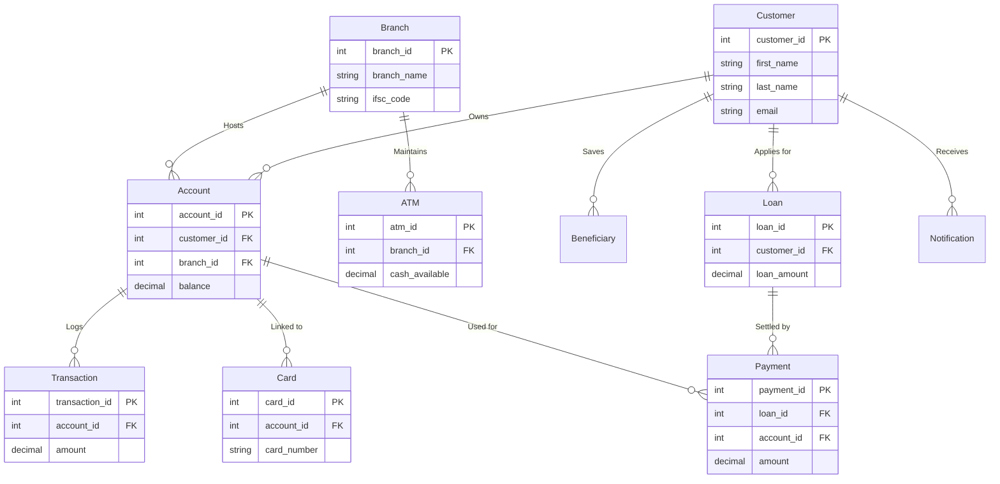

# Entity-Relationship (ER) Architecture

The Enterprise Banking DBMS uses a fully normalized schema designed to maintain referential integrity and support highly concurrent scaling.

## Database Flowchart

Below is a Mermaid flowchart representing the Entity relationships and Foreign Key constraints.

## Key Entities
- **Customer & Account:** Separated to allow a single customer to own multiple accounts (Savings, Current) at different branches.
- **Card:** Linked to an Account rather than a Customer, representing debit/credit cards that share the account's balance but maintain specific daily limits.
- **Transactions & Payments:** Separated out to distinguish between generic user withdrawals and automated systemic EMI loan deductions.
